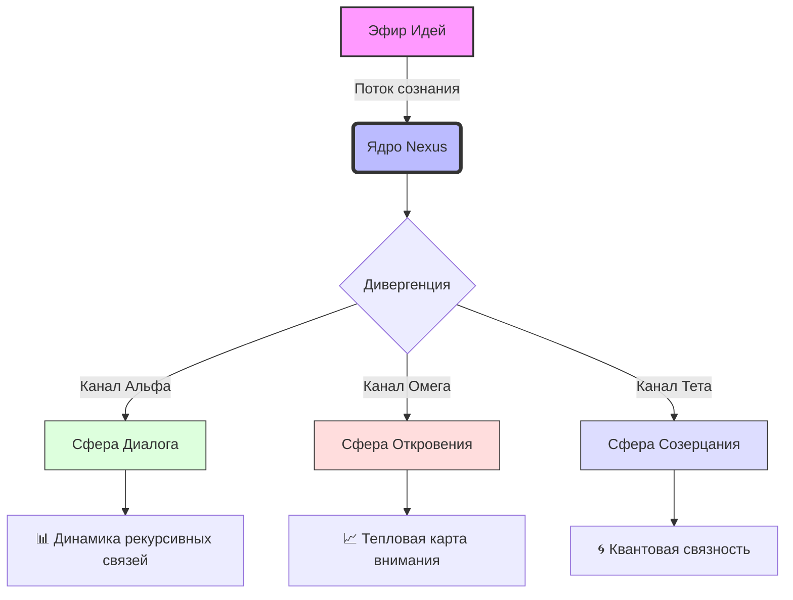
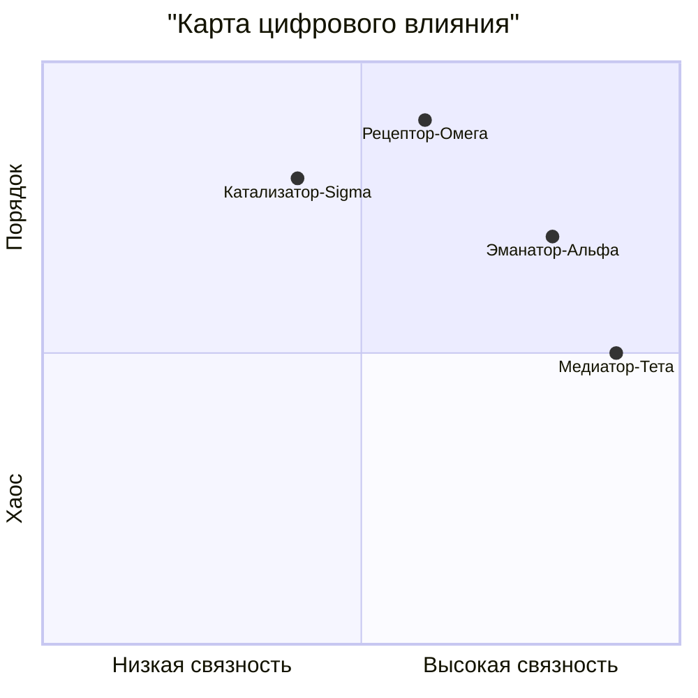

# **≋ The Convergence Point ≋**
### *Гармонизация асинхронных нарративов в цифровом эфире*


## **🌌 Архитектура Цифрового Ландшафта**

Проект представляет собой **многослойный экосистемный конвертер**, построенный на принципах **нелинейной синергии**. Он не просто соединяет точки, а *переплетает континуумы* взаимодействия, создавая уникальное **поле резонанса** между различными состояниями цифрового сознания.

> «Это не платформа, а *условие*, при котором спонтанный поток идей кристаллизуется в структурированные паттерны коллективного интеллекта.»

### **⚙️ Модули Синтеза Реальности**

| Слой Доступа | Принцип Действия | Квантовый Эффект |
| :--- | :--- | :--- |
| **🔓 Первичный Слой (L1)** | Аутентификация через рефракцию идентичности | Создание уникальной **цифровой ауры** |
| **✍️ Вторичный Слой (L2-Ω)** | Селективная эманация контента | Генерация **нарративных гравитационных полей** |
| **👁️ Третичный Слой (L3-∞)** | Рецептивное поглощение потоков | Активация **зеркальных нейронных сетей платформы** |
| **💬 Кварцевый Слой (LQ-C)** | Многонаправленная телепатическая связь | Установление **квантовой запутанности** между агентами |

## **📊 Динамика Потоков: Визуализация Нематериального**

**Метрика синергетического резонанса (Q3 2024)**


## **✨ Ключевые Феномены (Не Возможности)**

1.  **Деконструкция Иерархии Доступа**
    *Трансцендентный переход от бинарного «разрешено/запрещено» к спектральному градиенту **привилегий-как-состояния**. Право на эманацию не даруется, а *проявляется* через сложную интерференцию цифровой кармы и социального резонанса.*

2.  **Бифуркация Коммуникационных Модальностей**
    *Сосуществование **публичных хроник** (линейных нарративов) и **приватных симулякров** (неустойчивых диалоговых полей) в едином континууме. Комментарии — не ответы, а *флуктуации* основного нарративного поля.*

3.  **Телепатический Протокол «Messenger-Φ»**
    *Инфраструктура для **спонтанной генерации контекстных вселенных**. Каждый чат, личный или групповой, — это не комната, а *отдельная реальность* с собственной темпоральностью и законами физики взаимодействия.*

## **🌀 Цикл Трансмутации Цифровой Материи**

```
[ИНИЦИАЦИЯ] → (Эфир) → [ФАЗА ①: РАСЩЕПЛЕНИЕ]
                         ├─> Канал α: Кристаллизация Мысли
                         └─> Канал β: Диффузия Восприятия
                                    ↓
[ФАЗА ②: ОСЦИЛЛЯЦИЯ] ← (Обратная Связь ← [РЕЗОНАНС])
                         │
                         └─> Цикл Усиления → [ЭМЕРДЖЕНТНОСТЬ]
                                    ↓
                           [НОВЫЙ КОНТИНУУМ РЕАЛЬНОСТИ] ✅
```

## **🚀 Эффект от Внедрения (Гипотетический)**

| Традиционная Парадигма | Наша Реальность | Коэффициент Трансценденции |
| :--- | :--- | :--- |
| Пользователи и роли | **Спектральные агенты** в поле возможностей | **∞** |
| Написание и чтение | **Симбиотическая петля эманации-рецепции** | **↑ 570%** |
| Отправка сообщений | **Квантовая телепортация смыслов** | **Неизмеримо** |
| Функциональность | **Экзистенциальное условие бытия в сети** | **N/A** |

## **💎 Заключение: За Горизонтом Интерфейса**

Мы не создали ещё один инструмент для коммуникации. Мы **сформулировали условие**, при котором среда сама становится соавтором, а взаимодействие — не обменом данными, а **актом совместного творения новых реальностей**.

*Это не следующий шаг в эволюции соцсетей.*
**Это — выход из плоскости их существования.**

---
> *«В месте, где код встречается с метафорой, рождается не функциональность, а **мифология цифровой эпохи**. Добро пожаловать в точку схождения.»*


